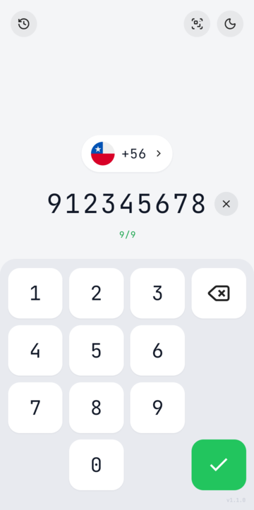
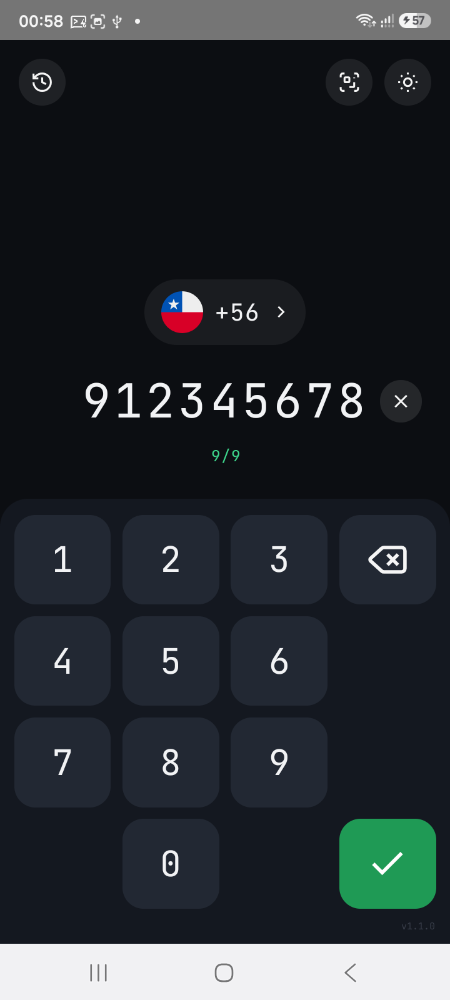
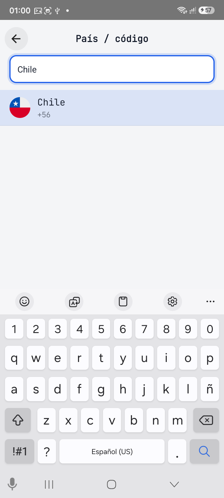
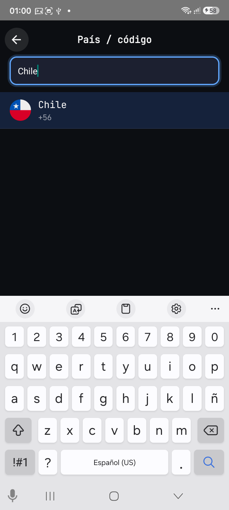
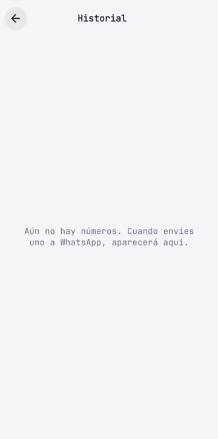
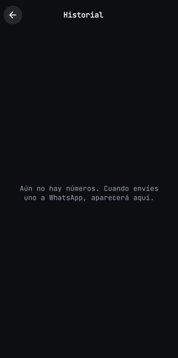
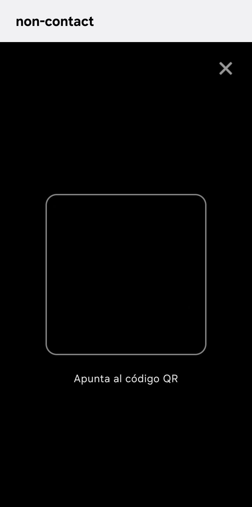

# non-contact

### Marcador rápido hacia WhatsApp — sin guardar el contacto

Abre un chat de WhatsApp con un número **sin agregarlo a tu agenda**. Ideal para pedidos, ventas, soporte, delivery y trámites: el número entra, el chat se abre, tu lista de contactos se queda limpia.

[](https://github.com/carlos-sweb/non-contact/releases/latest)
[](https://github.com/carlos-sweb/non-contact/releases/latest/download/app-release.apk)
[](https://github.com/carlos-sweb/non-contact/releases/latest/download/app-release.apk)
[](#características)

> **Descarga el APK en Releases**  
> → [app-release.apk (última versión)](https://github.com/carlos-sweb/non-contact/releases/latest/download/app-release.apk)  
> También en la página de [Releases](https://github.com/carlos-sweb/non-contact/releases/latest).

---

## Capturas

> Las rutas ya están listas. Cuando tengas PNGs reales del dispositivo, suéltalos en `assets/screenshots/`. Hasta entonces, GitHub mostrará el alt text.

| Modo claro | Modo oscuro |
|---|---|
|  |  |
|  |  |
|  |  |
|  |  |

**Qué capturar (checklist):** dialer con número de ejemplo, selector de país con buscador, historial, escáner QR, cada una en tema claro y oscuro. Ver [Prompt para generar capturas reales](#prompt-para-generar-capturas-reales) al final.

---

## ¿Qué es non-contact?

**non-contact** es una app Android para **abrir un chat de WhatsApp sin guardar contacto**. Escribes el número (o lo lees con un QR), confirmas, y WhatsApp se abre con ese teléfono.

Un marcador rápido para números temporales: los que no quieres — o no puedes — dejar en la agenda.

---

## ¿Por qué te va a servir?

Si tu día está lleno de números de un solo uso, la agenda se ensucia y WhatsApp se vuelve lento de navegar. non-contact acorta el camino: número → chat.

- **Pedidos y ventas** — clientes que escriben una vez.
- **Soporte** — tickets, reclamos, “mándame tu WhatsApp”.
- **Delivery y logística** — repartidores y destinatarios del día.
- **Comunidades y grupos** — alguien te pasa un número y solo necesitas hablarle ahora.
- **Trámites** — gestiones puntuales sin contactos eternos.

Si buscas *abrir chat de WhatsApp sin guardar contacto* o un *marcador rápido WhatsApp*, esto es exactamente eso.

---

## Características

- **Teclado numérico** para el número nacional.
- **País / código de marcación** (por defecto Chile `+56`), con lista de banderas y buscador.
- **Confirmación con ✓** — arma el número completo y abre WhatsApp.
- **Escáner QR** — si el QR contiene solo un número válido, lo carga en el dialer.
- **Historial** de hasta 50 números usados (dentro de la app).
- **Tema claro / oscuro**, recordado en el dispositivo.

---

## Cómo usarla

1. Elige el **país / código** (chip arriba; por defecto `+56`).
2. Escribe el **número nacional** en el teclado.
3. Pulsa **✓** cuando el número esté completo → se abre WhatsApp.
4. ¿Tienes el número en un QR? Usa el **escáner** en la cabecera; si es válido, aparece en el dialer.
5. ¿Ya lo usaste? Ábrelo otra vez desde el **historial**.
6. Cambia **tema claro / oscuro** cuando quieras; se guarda en el teléfono.

---

## Instalación / descarga

1. Descarga el APK:  
   [https://github.com/carlos-sweb/non-contact/releases/latest/download/app-release.apk](https://github.com/carlos-sweb/non-contact/releases/latest/download/app-release.apk)
2. En Android, permite instalar desde esa fuente (ajustes de “instalar apps desconocidas” / similares, según tu versión).
3. Abre el APK e instala.
4. Ten **WhatsApp** instalado: non-contact le pasa el número; el chat lo abre WhatsApp.

**Gratis.** Se distribuye como APK en GitHub Releases.

---

## Privacidad (lo que sí sabemos)

- **No agrega contactos a tu agenda.** El flujo es marcar → abrir WhatsApp.
- En el dispositivo guarda cosas útiles de la app: **país**, **tema** e **historial** (hasta 50 entradas).
- Permisos que declara la app:
  - **Cámara** — para el escáner QR.
  - **Internet** — para el entorno de la app / host.
  - **Vibrar** — feedback cuando un QR no es un número válido.

No afirmamos “cero datos” ni “sin permisos”: usamos lo mínimo descrito arriba. No hay integración con la agenda del sistema.

---

## Tecnología y arquitectura

- UI con **Lynx** + **Mithril** ([`mithril-lynx`](https://github.com/carlos-sweb/mithril-lynx)).
- Empaquetada en un **host Android nativo** (`com.example.noncontact`).
- El APK público sale de los **GitHub Releases** de este repo.

Código de la app y del host: carpetas `non-contact/` y `non-contact-android/` en este repositorio. Detalle de build en el [README técnico](non-contact/README.md).

---

## Preguntas frecuentes

**¿Necesito WhatsApp instalado?**  
Sí. non-contact prepara el número y abre WhatsApp; no reemplaza WhatsApp.

**¿Se guarda el número en mis contactos?**  
No. Puede quedar en el **historial de la app** (hasta 50), no en la agenda del teléfono.

**¿Por qué pide cámara?**  
Solo para el **escáner QR**. Si el QR no es un número de teléfono válido, no lo carga (y puede vibrar como aviso).

**¿Funciona con cualquier país?**  
Sí eliges el código en la lista (banderas + buscador). El valor inicial es Chile (`+56`).

**¿Cómo actualizo?**  
Descarga de nuevo el APK desde [Releases](https://github.com/carlos-sweb/non-contact/releases/latest) e instálalo encima.

**¿Está en Google Play?**  
Hoy se distribuye como APK en GitHub. No afirmamos disponibilidad en tiendas.

**¿Es para iPhone?**  
Esta distribución es **Android (APK)**.

---

## Roadmap / ideas futuras

Ideas, **no promesas** ni fechas:

- Atajos para reabrir el último número.
- Mejoras de accesibilidad y contraste.
- Más formas de pegar / compartir un número hacia el dialer.
- Empaquetado o canales de distribución adicionales, si tiene sentido.

Si tienes una idea concreta, ábrela como issue.

---

## Contribuir, bugs y licencia

- **Bugs e ideas:** [Issues](https://github.com/carlos-sweb/non-contact/issues) en este repo.
- **Código:** carpetas `non-contact/` (UI Lynx) y `non-contact-android/` (host).
- **Licencia:** por definir (placeholder). El código está visible en GitHub; la licencia formal se publicará cuando esté lista.

---

## Empieza en un minuto

1. [Descarga el APK](https://github.com/carlos-sweb/non-contact/releases/latest/download/app-release.apk)  
2. Dale una **estrella** al repo si te sirve  
3. **Comparte** el link con quien vive de números temporales  

*WhatsApp sin agregar contacto. Marcador rápido. Agenda limpia.*

---

## English quick summary

**non-contact** is a free Android APK that opens a WhatsApp chat from a phone number **without saving a contact**. Type the national number (default country Chile `+56`), confirm with ✓, or scan a phone-only QR. Keeps an in-app history (up to 50) and light/dark theme. Download: [latest `app-release.apk`](https://github.com/carlos-sweb/non-contact/releases/latest/download/app-release.apk).

---

## Prompt para generar capturas reales

Úsalo en el teléfono (o emulador) con el APK instalado:

```text
Objetivo: capturas reales de non-contact para el README de GitHub.
Dispositivo: Android, barra de estado limpia si puedes (sin notificaciones sensibles).
Número de ejemplo en dialer: 912345678 con código +56 visible (Chile).
NO inventes UI: captura la app tal cual (confirmación = icono ✓, no un botón de texto).

Archivos a guardar (PNG, ~1080×1920 o similar portrait):

Modo CLARO:
1) assets/screenshots/light/dialer.png     — dialer con el número de ejemplo, chip +56
2) assets/screenshots/light/countries.png  — lista País/código con buscador visible
3) assets/screenshots/light/history.png    — historial (con al menos 1–2 entradas de prueba)
4) assets/screenshots/light/scanner.png    — pantalla del escáner QR (permiso cámara concedido)

Modo OSCURO: repetir 1–4 en
assets/screenshots/dark/{dialer,countries,history,scanner}.png

Orden sugerido: tema claro → 4 pantallas → cambiar a oscuro → mismas 4.
Evitar datos personales reales; usa números de prueba.
```
